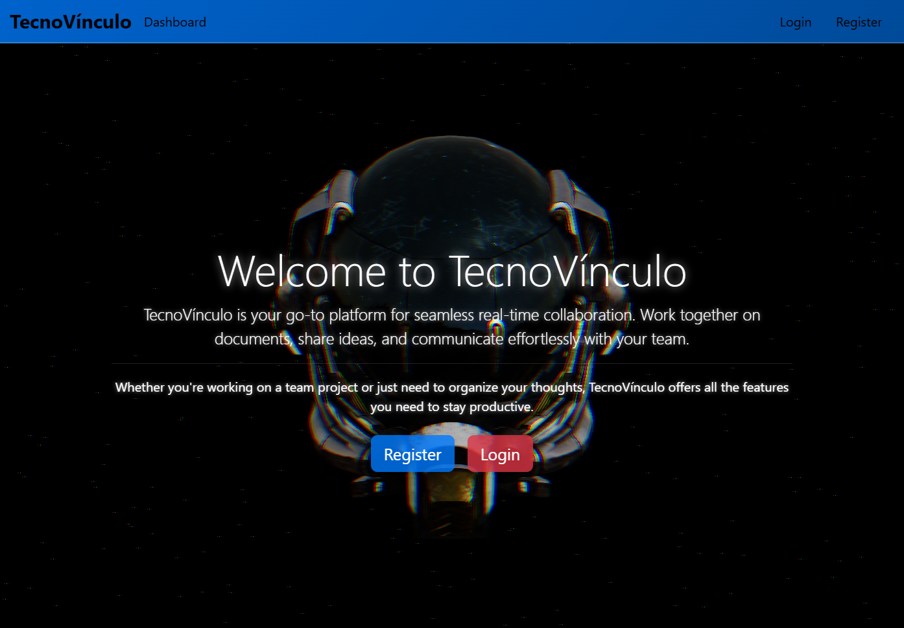

# TecnoVínculo - Frontend



This is the **Frontend** module of **TecnoVínculo**, a real-time collaborative tool designed to empower teams by enabling seamless communication and live project collaboration.

## Features

- **Interactive UI**: Built with React.js for a responsive and engaging experience.
- **Live Collaboration**: Users can work simultaneously with real-time updates.
- **3D Background Effects**: Enhanced visuals with Three.js for an immersive experience.
- **Form Validation**: Secure and user-friendly login and registration forms.
- **Dynamic Navigation**: Easy to switch between collaborative sessions and other features.

## Tech Stack

- 
- 
- 

## Folder Structure

- `public`: Contains static assets such as the main `index.html` file.
- `src`: Main source code for the frontend.
  - `components`: Reusable components like login forms and interactive elements.
  - `App.js`: Entry point for the application.
- `package.json`: Contains the dependencies and scripts for the project.
- `README.md`: Documentation for the frontend module.

## Getting Started

### Prerequisites

- Node.js (v16 or later)
- npm (v8 or later)

### Installation

1. Clone the repository and navigate to the frontend folder:
   ```bash
   git clone https://github.com/Onkar3107/TecnoVinculo.git
   cd Tecnovinculo/Frontend
   ```

2. Install dependencies:
   ```bash
   npm install
   ```

3. Run the development server:
   ```bash
   npm start
   ```

4. Open [http://localhost:3000](http://localhost:3000) in your browser.

## Contributing

To contribute to the frontend module:
1. Fork the repository.
2. Create a branch for your feature (`git checkout -b feature-name`).
3. Commit and push your changes.
4. Submit a pull request for review.

---

Developed with ❤️ by Onkar Rane.

---