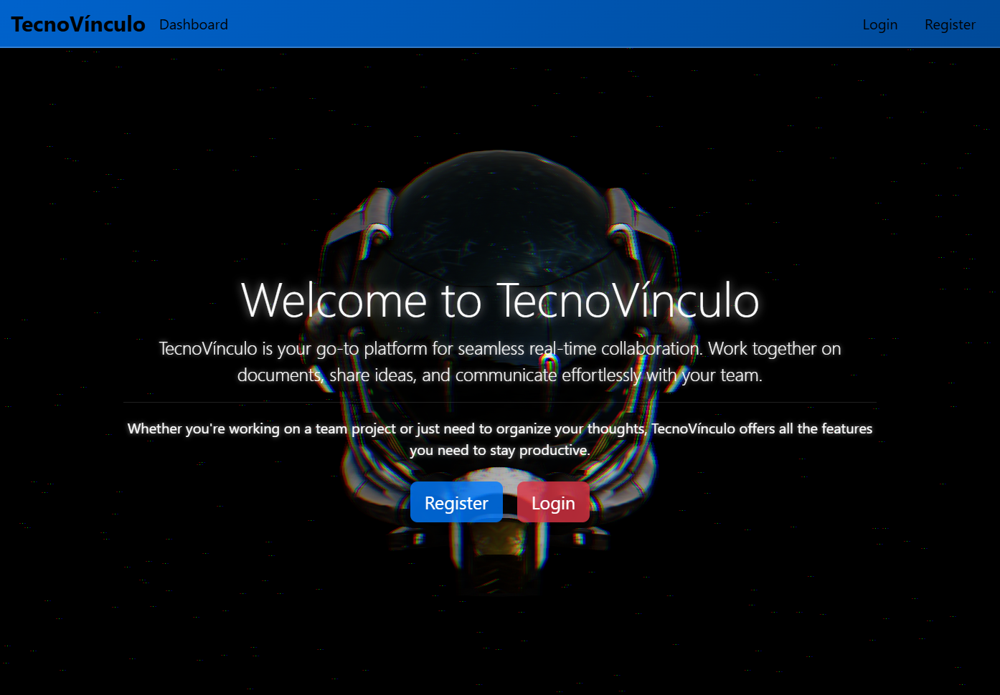

# TecnoVínculo



**TecnoVínculo** (meaning "Technological Bond" in Spanish) is a cutting-edge real-time collaborative tool designed to enhance teamwork and productivity by enabling seamless communication and live coding collaboration in a highly interactive environment.

## Features

- **Real-Time Coding**: Live collaboration with updates visible instantly across all users.
- **Interactive UI**: User-friendly design with dynamic navigation.
- **Multi-Language Support**: Works with multiple programming languages.
- **3D Visuals**: Engaging background effects powered by Three.js.
- **Secure Authentication**: Robust login and registration system.

## Tech Stack

- **Frontend**: React.js for dynamic and responsive user interfaces.
- **Backend**: Node.js and Express.js for managing the server and APIs.
- **Database**: MongoDB for scalable and efficient data storage.
- **Real-Time Communication**: Socket.IO for synchronized collaboration.
- **3D Animations**: Three.js for immersive visual effects.

## Project Structure

```
TecnoVínculo/
├── Frontend/
│   ├── public/
│   ├── src/
│   ├── package.json
│   ├── README.md
├── Backend/
│   ├── models/
│   ├── config/
│   ├── middleware/
│   ├── routes/
│   ├── server.js
│   ├── package.json
│   ├── README.md
```

- `Frontend`: Contains the user interface code.
- `Backend`: Includes API logic, server-side operations, and database models.
- `README.md`: Documentation for the complete project.

## Getting Started

### Prerequisites

- Node.js (v16 or later)
- npm (v8 or later)

### Installation

1. Clone the repository:
   ```bash
   git clone https://github.com/Onkar3107/TecnoVinculo.git
   cd TecnoVinculo
   ```

2. Navigate to the frontend and backend directories to install dependencies:
   ```bash
   cd Frontend
   npm install
   cd ../Backend
   npm install
   ```

3. Start the backend server:
   ```bash
   cd Backend
   npm start
   ```

4. Start the frontend server:
   ```bash
   cd ../Frontend
   npm start
   ```

5. Open [http://localhost:3000](http://localhost:3000) to view the application.

## Contributing

To contribute to the project:
1. Fork the repository.
2. Create a branch for your feature (`git checkout -b feature-name`).
3. Commit and push your changes.
4. Submit a pull request for review.

---

## Future Enhancements

- **Real-Time Video and Audio Collaboration**:  
  Implement integrated video and audio chat features for seamless communication during live coding sessions, making team collaboration more interactive and efficient.

- **Expanded Multi-Language Support**:  
  Broaden the scope of supported programming languages to include a wider range of languages, enabling more developers to collaborate on various types of projects.

- **Integrated Terminal for Command Execution**:  
  Introduce a built-in terminal feature, allowing users to run basic shell commands directly within the app for easier project management and testing without leaving the environment.

- **Collaborative Whiteboard**:  
  Implement a shared whiteboard feature for teams to brainstorm, diagram, and visualize their ideas in real-time.

--- 
## Connect with Me

I'm always open to collaboration and discussions! Feel free to connect with me on LinkedIn:

[](https://www.linkedin.com/in/onkar-rane-8841b72a7)

---

Developed with ❤️ by Onkar Rane.